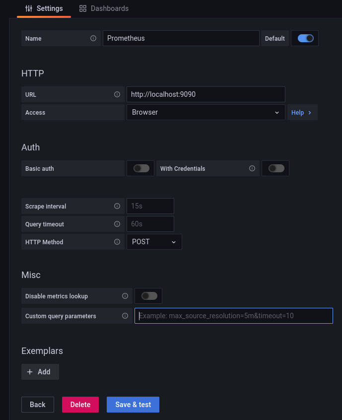

# Extremely simple prometheus stack

A very simple prometheus/grafana stack.

## Overview
 - [Prometheus server](https://prometheus.io/docs/prometheus/latest/installation/)
 - [Node exporter container](https://github.com/prometheus/node_exporter)
 - [Grafana](https://grafana.com/docs/grafana/latest/installation/docker/)

## Requirements
  - Docker
  - docker-compose

## Configure Grafana

 - go to configuration -> data sources
 - Add data source
 - Find the following configs and set them to the values below (as shown in image)
    * URL: http://127.0.0.1:9090
    * Access: Browser (this is set to server by default)
 - Save & test

## Web UI(s)
 - [Prometheus:127.0.0.1:9090](127.0.0.1:9090)
 - [node_exporter:127.0.0.1:9000](127.0.0.1:9000)
 - [grafana:127.0.0.1:3000](127.0.0.1:3000)

## Run with docker-comose
 - Start the containers: docker-compose up 
 - Stop the containers: docker-compose down 

# Grafana credentials
 - uname: admin
 - pass: admin
